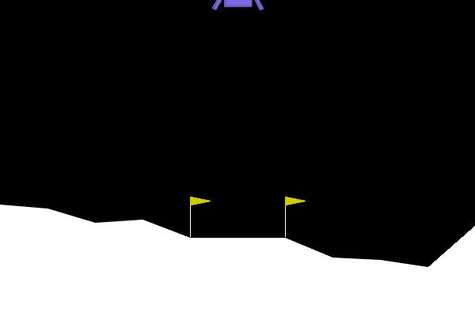
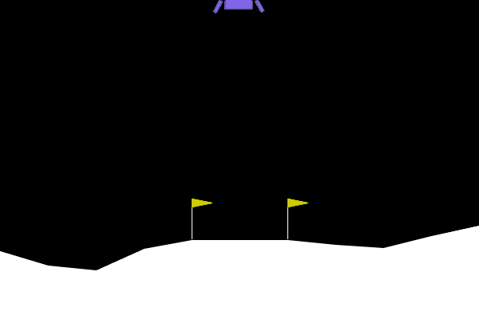
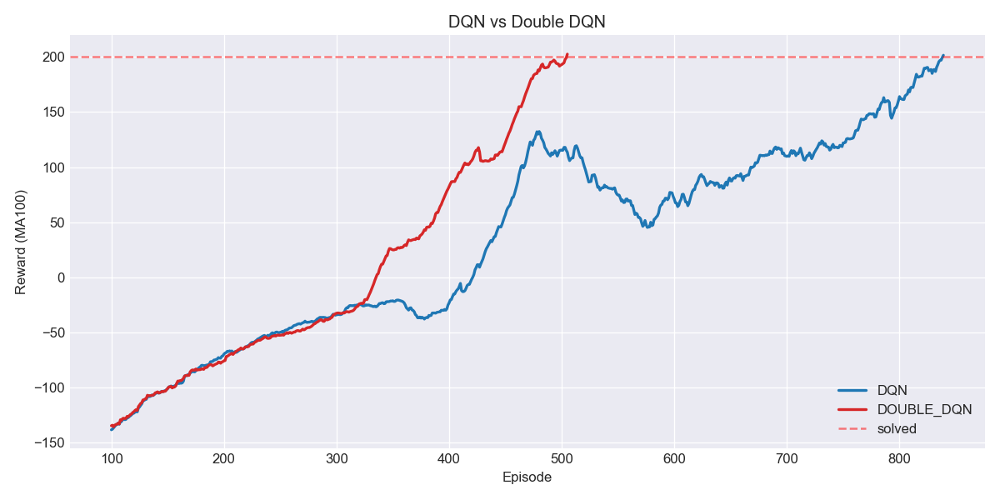
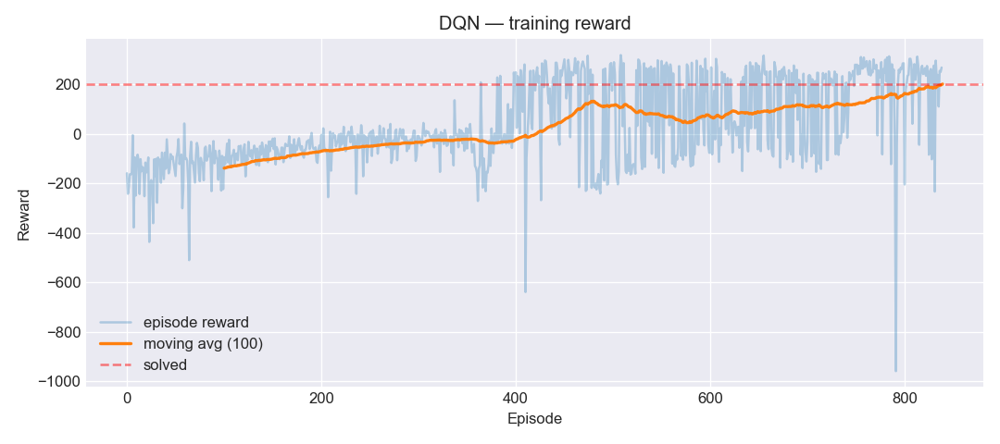
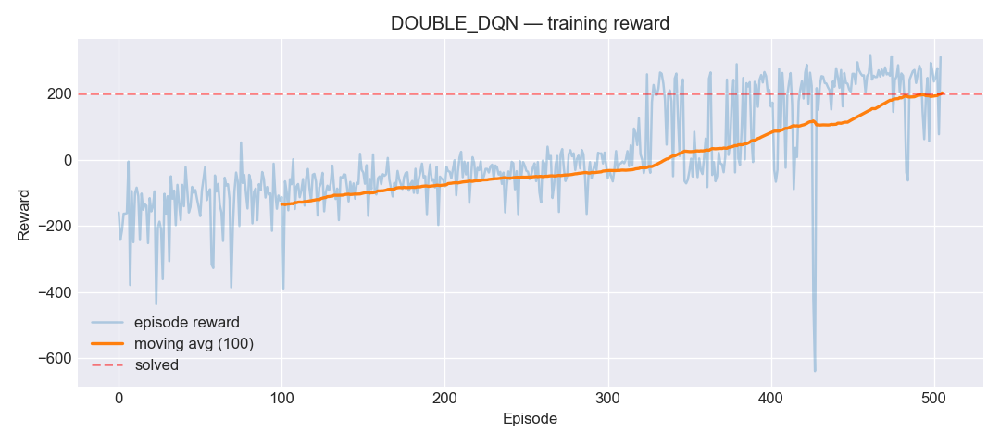

# Lunar Lander — DQN / Double DQN

Implémentation from-scratch d'un agent **Deep Q-Network** et de sa variante **Double DQN** en PyTorch pour résoudre [LunarLander](https://gymnasium.farama.org/environments/box2d/lunar_lander/) (Gymnasium).

## Démo

| Random (avant training) | DQN — ep 400 | DQN — entraîné |
|:---:|:---:|:---:|
|  |  |  |
| reward ≈ -338 | apprend à freiner | atterrissage propre |

## Résultats

| Agent | Épisodes pour résoudre (avg100 ≥ 200) | Avg final (100 ep) |
|---|:---:|:---:|
| DQN | 839 | 201.5 |
| Double DQN | **505** | 202.5 |

Double DQN converge ~**40% plus vite** que DQN classique sur cette config — cohérent avec ce qu'on attend de la réduction du biais de surestimation.



### Courbes individuelles

| DQN | Double DQN |
|:---:|:---:|
|  |  |

## Quick start

```bash
brew install swig                    # requis pour box2d
pip install -r requirements.txt

python train.py                      # DQN
python train.py --double-dqn         # Double DQN
python make_plots.py                 # courbes finales
```

Le training s'arrête automatiquement dès que la récompense moyenne sur 100 épisodes ≥ 200, et sauvegarde checkpoints + GIFs au passage.

Alternatives : [`main.ipynb`](main.ipynb) pour un workflow notebook, [`compare_strategies.ipynb`](compare_strategies.ipynb) pour comparer les schedules ε-greedy.

## Méthode

- **Q-network** : MLP, 2 couches cachées de 128 unités (ReLU)
- **ε-greedy** avec decay linéaire de 1.0 → 0.01 sur 50 000 steps
- **Replay buffer** classique, capacité 100k
- **Target network** mis à jour tous les 500 steps (hard update)
- **Double DQN** : action max sélectionnée par le Q-network online, évaluée par le target network

Hyperparamètres : `lr=5e-4`, `γ=0.99`, `batch=64`, loss Huber, gradient clipping à 10.

## Structure

```
.
├── main.ipynb                # notebook principal (training + plots)
├── compare_strategies.ipynb  # comparaison ε-decay & target update freq
├── train.py                  # script d'entraînement CLI
├── make_plots.py             # plots à partir des rewards sauvegardés
├── src/
│   ├── network.py            # Q-network (MLP)
│   ├── buffer.py             # replay buffer
│   ├── agent.py              # agent DQN / Double DQN
│   └── utils.py              # seed, vidéos, eval
└── outputs/
    ├── videos/               # GIFs des épisodes
    ├── plots/                # courbes d'apprentissage
    └── checkpoints/          # poids et rewards sauvegardés
```

## Stack

`torch`, `gymnasium[box2d]`, `numpy`, `matplotlib`, `imageio`, `tqdm`. Tourne en CPU (~15-25 min sur un Mac M3).
